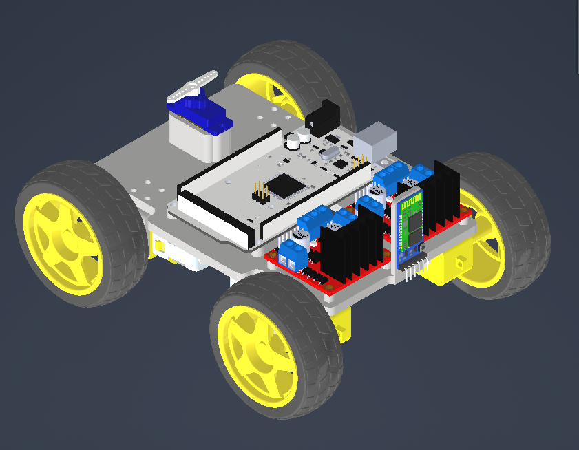
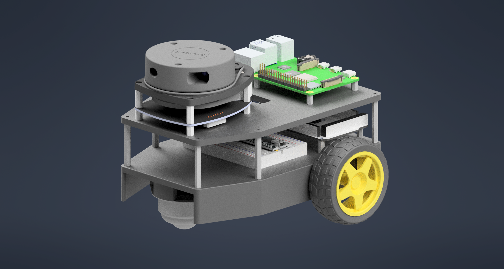

# ROS Automated Guided Vehicle

A research project for developing an autonomous mobile robot using ROS and the ROS navigation stack. This project is still in the research phase and is not expected to be completed anytime in the near-future. See the research folder for notes about the project as I am researching and learning robotics.  

## Phase One Goals [In-Progress]
- [x] Design a chassis for a simplified version of the robot
- [x] Integrate L298N Motor Controllers with TT 3-6V DC Motors
- [x] Develop Firmware for MEGA2560
- [ ] Test/calibrate DC encoders for Phase Two Integration
- [ ] Test/calibrate IMU for Phase Two Integration

## Phase Two Goals
- [x] Design a differential drive AGV
- [ ] Integrate SBC with Ubuntu & ROS Noetic
- [ ] Establish communication between embedded controller and ROS using rosserial package
- [ ] Setup Hardware Interfaces in ROS for motor control and LIDAR data aquisition
- [ ] Setup Remote Control of Robot
- [ ] Implement ROS Navigation Stack (Localization, Costmap, Navigation)
- [ ] Aquire SLAM Data with RPLidar A1M8 using ROS libraries and packages

## Phase Three Goals
- OpenCV Object Recognition
- Flask Webserver for Remote Control and Configuration of Robot
