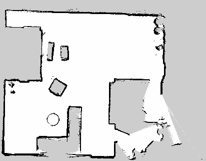

<!-- Improved compatibility of back to top link: See: https://github.com/othneildrew/Best-README-Template/pull/73 -->

<!--
*** Thanks for checking out the Best-README-Template. If you have a suggestion
*** that would make this better, please fork the repo and create a pull request
*** or simply open an issue with the tag "enhancement".
*** Don't forget to give the project a star!
*** Thanks again! Now go create something AMAZING! :D
-->

<!-- PROJECT SHIELDS -->
<!--
*** I'm using markdown "reference style" links for readability.
*** Reference links are enclosed in brackets [ ] instead of parentheses ( ).
*** See the bottom of this document for the declaration of the reference variables
*** for contributors-url, forks-url, etc. This is an optional, concise syntax you may use.
*** https://www.markdownguide.org/basic-syntax/#reference-style-links
-->
[![Contributors][contributors-shield]][contributors-url]
[![Forks][forks-shield]][forks-url]
[![Stargazers][stars-shield]][stars-url]
[![Issues][issues-shield]][issues-url]
[![LinkedIn][linkedin-shield]][linkedin-url]

<!-- PROJECT LOGO -->
 

 <!--  -->

<h3 align="center">ROS Differential Drive Autonomous Mobile Robot</h3>

  

    An autonomous differential drive mobile robot built with a MEGA 2560, L298N Driver, DG01D-E DC Motor w/ Encoder, Bosch BNO055, Raspberry Pi 4, and RPLIDAR A1M8.
  

<!-- ABOUT THE PROJECT -->
## About The Project

 

This project is a versatile robot integrating a MEGA 2560 microcontroller, L298N motor driver, DG01D-E DC motors with encoders, Bosch BNO055 IMU, Raspberry Pi 4, and RPLIDAR A1M8 Lidar sensor. Operating on ROS Noetic, the robot combines these components to achieve advanced capabilities. It employs a differential drive mechanism for precise movement control and integrates encoder feedback for accurate odometry. The Bosch BNO055 IMU enhances orientation data, aiding sensor fusion for improved perception. The RPLIDAR A1M8 creates real-time 2D maps crucial for obstacle avoidance and navigation. Leveraging ROS's power, the robot autonomously plans paths, avoiding obstacles safely. The Raspberry Pi 4 serves as the central processing unit, enabling remote control and monitoring. This project finds application in indoor navigation, education, service robotics, exploration, and inspections. By uniting hardware, sensor fusion, and ROS, the Autonomous Mobile Differential Drive Robot exemplifies an intelligent robotic platform adaptable to diverse scenarios.

(<a href="#readme-top">back to top</a>)

### Built With
* [![ROS][ROS]][ROS-url]
* [![Python][Python]][Python-url]
* [![C++][C++]][C++-url]
* [![Ardunio][Ardunio]][Ardunio-url]

(<a href="#readme-top">back to top</a>)

<!-- ROADMAP -->
## Roadmap for Version 2.1

- [x] Design a CAD model for a differential drive AGV with a 3D printed chassis
- [x] Install Ubuntu Server 20.04 and ROS Noetic on a Raspberry Pi 4 
- [x] Create URDF (Unified Robot Description Format) and xacro files
- [x] Setup Simulation Environment with Gazebo 
- [x] Create Program for Embedded Microcontroller for Motor Control 
- [x] Publish Measured Wheel Velocities to ROS from Microcontroller
- [x] Setup ROS Control 
- [x] Setup Hardware Interface to handle communication between microcontroller and ROS (using ROSSerial)
- [x] Setup and Test diff_drive_controller. Tune PID values for wheel velocity control
- [x] Create a teleop package for manual control of the robot using keyboard or joystick
- [x] Setup RPLidar A1M8 Sensor Interface
- [x] Create package for SLAM (Simultaneous Localization and Mapping) with slam_toolbox
- [x] Generate a map of the environment using SLAM
- [ ] Fetch IMU data from BNO055 and publish to ROS
- [ ] Integrate Robot Localization Package with IMU and Odometry
- [x] Setup Navigation Stack with AMCL (Adaptive Monte Carlo Localization) and move_base
- [ ] Create Flask app to remotely control and monitor the robot
- [ ] Integrate Raspberry Pi 4 Camera Module for Remote Video Streaming

(<a href="#readme-top">back to top</a>)

## Latest Progress Report 7/25/23
Generated a SLAM map of my basement using the graph-based SLAM algorithm from the slam_toolbox package. The map was generated using the RPLidar A1M8 sensor with a resolution of 0.3. Had some troubles getting asynchronous online SLAM to generate the map properly over my local network. As a result, I switched to Synchronous online SLAM and that seemed to resolve the issue. 

Here is a [Video demo](https://www.youtube.com/watch?v=7yjPUBrIlA8) of using slam_toolbox to generate a map of my basement with Synchronous Online SLAM. 

<!-- MARKDOWN LINKS & IMAGES -->
<!-- https://www.markdownguide.org/basic-syntax/#reference-style-links -->
[contributors-shield]: https://img.shields.io/github/contributors/czagrzebski/ROS-AMR.svg?style=for-the-badge
[contributors-url]: https://github.com/czagrzebski/ROS-AMR/graphs/contributors
[forks-shield]: https://img.shields.io/github/forks/czagrzebski/ROS-AMR.svg?style=for-the-badge
[forks-url]: https://github.com/czagrzebski/ROS-AMR/network/members
[stars-shield]: https://img.shields.io/github/stars/czagrzebski/ROS-AMR.svg?style=for-the-badge
[stars-url]: https://github.com/czagrzebski/ROS-AMR/stargazers
[issues-shield]: https://img.shields.io/github/issues/czagrzebski/ROS-AMR.svg?style=for-the-badge
[issues-url]: https://github.com/czagrzebski/ROS-AMR/issues
[license-shield]: https://img.shields.io/github/license/github_username/repo_name.svg?style=for-the-badge
[license-url]: https://github.com/github_username/repo_name/blob/master/LICENSE.txt
[linkedin-shield]: https://img.shields.io/badge/-LinkedIn-black.svg?style=for-the-badge&logo=linkedin&colorB=555
[linkedin-url]: https://www.linkedin.com/in/creed-zagrzebski-96362a1ab/
[product-screenshot]: images/screenshot.png
[Python]: https://img.shields.io/badge/Python-3776AB?style=for-the-badge&logo=python&logoColor=white
[Python-url]: https://www.python.org/
[ROS]: https://img.shields.io/badge/ROS-22314E?style=for-the-badge&logo=ros&logoColor=white
[ROS-url]: https://www.ros.org/
[C++]: https://img.shields.io/badge/C++-00599C?style=for-the-badge&logo=c%2B%2B&logoColor=white
[C++-url]: https://www.cplusplus.com/
[Ardunio]: https://img.shields.io/badge/Arduino-00979D?style=for-the-badge&logo=arduino&logoColor=white
[Ardunio-url]: https://www.arduino.cc/
