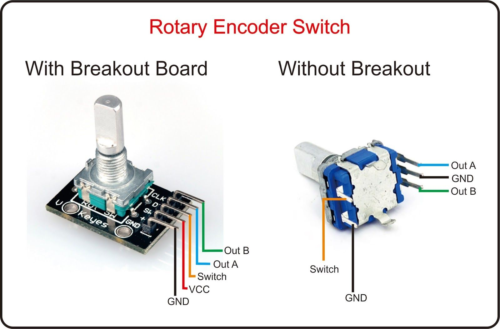

# DC Motor Encoder Research 


## Overview
 A DC motor encoder is a device that is used to measure the speed and position of a direct current motor. It typically consists of a sensor that is attached to the motor shaft, which generates pulses as the shaft rotates. These pulses are converted into a digital signal that can be read by a control systems, allowing the motor's speed and position to be monitored and controlled. The data gathered by the encoder will be used in combination with an IMU for odometry the fundamental algorithm for computing robotic motion. 

 There are two main types of motor encoders:
    
1. **Absolute encoders:** Gives a unique digital code for each distinct position of the motor shaft, allowing the exact position of the shaft to be determined at any time. Often used where precise position is required, especially in robot or machine tool applications
2. **Incremental Encoders:** An incremental encoder generates a series of pulses as the motor rotates, with the frequency of the pulses proportional to the speed of the shaft. This encoder does not provide absolute position measurement, but rather provides information about the change in position over time. Often used in applications where speed and relative position are more important than absolute position, such as conveyors or positioning stages.

Encoders can be analog or digital, and can use various technology to detect shaft rotation, including optical, magnetic, and capacitive sensors. 

This project does not need absolute positioning, thus we will be using incremental encoders. This will allow us to determine velocity, positioning, and orientation of the robot. We can also implement a PID Controller for optimal control of the speed of the robot given the feedback of the encoder.

## Brief Introduction to PID Control Systems

A PID controller will be used to control the speed of the DC motor using the feedback given by the encoder. This will allow us to control the PWM value to maintain an output such that there is little error in the closed-loop operation of the dynamic system. 


The output of the PID control circuit, $u(t)$, is given as:

$u(t) = K_pe(t)+K_i\int_{0}^{t}e(t)dt + K_p\frac{de}{dt}$

Where $K_p$ = Proportional Gain, $K_i$ = Integral Gain, $K_d$ = Derivative Gain, $r(t)$ is the set point, $y(t)$ is the measured process variable, and $e(t) = r(t) - y(t)$. The $K$ constants can be tuned for a more stable controller to fix various issues such as rise time, overshoot, settling time, stability, and steady-state error. See the PID research document for more information (Not yet complete). 


In context of the AGV, the $y(t)$ would be the actual speed of the RC car measured by the encoder, while the set point would be the desired speed. The $e(t)$ would be the error and the PID control will calculate a new PWM value to achieved the desired set point.

The [Arduino PID library](https://github.com/br3ttb/Arduino-PID-Library) will be used later on to handle the calculations for input signals. The Arduino will take velocity commands via ROSSerial and hand this information to our PID controller, which in return will calculate a PWM value to achieve the desired result. 

## Calculate direction and speed of DC motor using an Encoder

Using the signals generated by the Encoder, we can calculate the relative direction and speed of the DC motor. Inside the encoder is a slotted disc that is typically connected to ground. It also has two contact pins A and B. 


As the motor spins, these contact pins generated a signal. When the knob is turned clockwise, the A pin connects to ground before the B pin. When the knob is turned anticlockwise, the B pin connects to the ground before the A pin. 


When A changes state:
- If $B \neq A$, the shaft is turned clockwise 
  
  
- If $B = A$, the shaft is turned counter clockwise
 
    

Thus, we can use this information to determine the direction that the motor is spinning. The A pin can be used for state detection to detect change in position of the shaft, which can then fire a subroutine to calculate the orientation of the movement. 

An encoder typically has the following I/O:



The Out A will be used for our state detection (via Hardware Interrupt) and Out B will be used for finding the direction. Out A/B will be connected as Digital inputs to the Arduino. Note: The image shown is a dedicated rotary switch and is not connected to a DC motor. However, a DC motor with a built-in encoder will have the Out A/B built-in to the motor I/O.

In order to determine the speed, we need to calculate the RPM of our motor. This will then allow us to use the circumference of our wheel to convert angular to linear velocity. 
To calculate RPM, we use the following equation:

$RPM = \frac{revolutions}{minute} \rightarrow \frac{pulses}{second} * \frac{60 \text{ seconds}}{1 \text{ minute}} * \frac{1 \text { revolution}}{\text{X Pulses}}$

$RPM = \frac{revolutions}{minute} \rightarrow \frac{(\text{Pulses Per Second} * 60)}{\text{Pulses Per Revolution}}$

Pulses per second is the number of pulses monitored within a one second period. We then convert it to pulses per minute by multiplying it by 60, since we are looking for revolutions per minute and not per second. We then divide this by the constant Pulses Per Revolution, which can be calculated by measuring the amount of pulses when manually rotating the encoder $360\degree$.

The following program can be used to determine the number of pulses for each revolution of the drive shaft. 

```c++
#include <Arduino.h>

const byte hallA = 2; // CLK Input
const byte hallB = 3; // DT Input
volatile int encoderTicks = 0; // Number of ticks (volatile)

void setup() {
  Serial.begin(9600);
  pinMode(hallA, INPUT);
  pinMode(hallB, INPUT);
  attachInterrupt(digitalPinToInterrupt(hallA), onHallTrigger, RISING);
}

void loop() {
  Serial.println(encoderTicks);
}

// Hall Interrupt Service Routine (ISR)
void onHallTrigger() {
  if(digitalRead(hallA) != digitalRead(hallB)) {
    encoderTicks++;
  } else {
    encoderTicks--;
  }
}

```

When the ```CLK``` input signal goes high (RISING), the signal is detected by the microcontrollers interrupt request (IRQ) controller. This event is binded using the ```attachInterrupt``` routine. The IRQ sets a flag for the interrupt with the highest priority and then saves the Program Counter (PC), status registers, and other relevant registers onto the stack. The microcontroller then jumps to the address of the ISR function ```onHallTrigger``` and increments ```encoderTicks```. Because ```encoderTicks``` is shared between the normal program, we need to declare it as ```volatile``` to prevent a race condition from occurring when the registers are restored from the stack (does not cache values in registers or memory). When the ISR is ran, it checks the status of both sensors to determine direction of the drive shaft.

Upon the start of the program, the encoderTicks is initialized to zero. Rotating the drive shaft will cause that value to increment. To find the pulses per revolution, rotate the drive shaft 360 degrees and record the value that is sent back via serial. 

Now that we have the number of ticks per revolution, we can create program to determine the current speed of the wheel by transforming angular velocity.

```c++
#include <Arduino.h>
#include "motor.h"

// Number of motor encoder ticks per shaft revolution (from ticker counter program)
#define ENC_COUNT_REV 146

// Hall Sensor Pins for Motor A & B
#define motorAHallA 2
#define motorAHallB 3

// Stores the number of hall encoder ticks for each motor
volatile long motorATicks = 0;

// Controller Update Interval
const int updateRate = 1000;
long lastUpdate = 0;

// Diameter of the wheels (in mm)
const int wheelDiameter = 65;

// Setup Motors (Pins are currently undefined)
Motor motorA = Motor(4, 5, 6);

void setup() {
    // Attach Interrupts to ISR
    attachInterrupt(digitalPinToInterrupt(motorAHallA), onHallATrigger, RISING);
}

void loop() {
   if(millis() - lastUpdate >= updateRate) {
        // Calculate new setpoint
        calculateMotorVelocity();
        lastUpdate = millis();
   }
}

void calculateMotorVelocity() {
    velMotorAOutput = ((motorATicks/ENC_COUNT_REV) * (PI * wheelDiameter))/1000;
    Serial.println(velMotorAOutput);
    
    // Reset tick count for next iteration
    motorATicks = 0;
}

// Interrupt Service Routine for Motor A Encoder
void onHallATrigger() {
    motorATicks++;
}

```

This program will calculate the velocity of our wheel in m/s. The ```ENC_COUNT_REV``` definition holds the number of pulses per rotation that we determined using the first program.